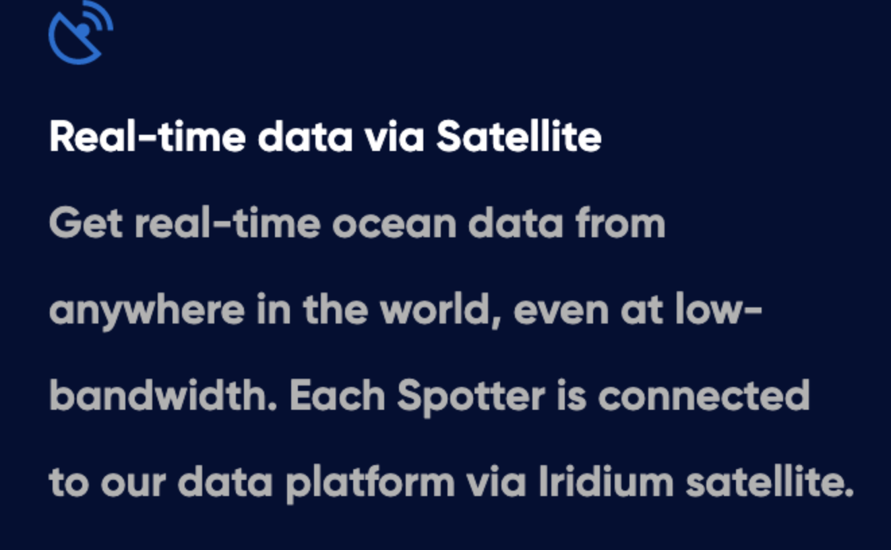
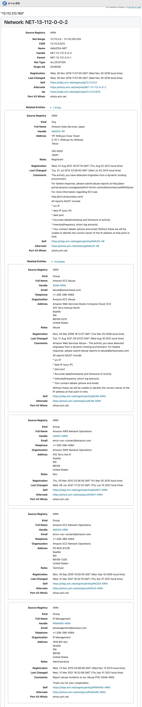
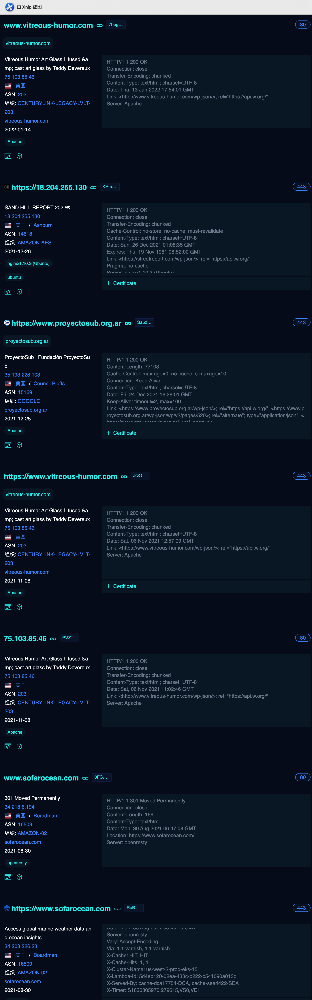
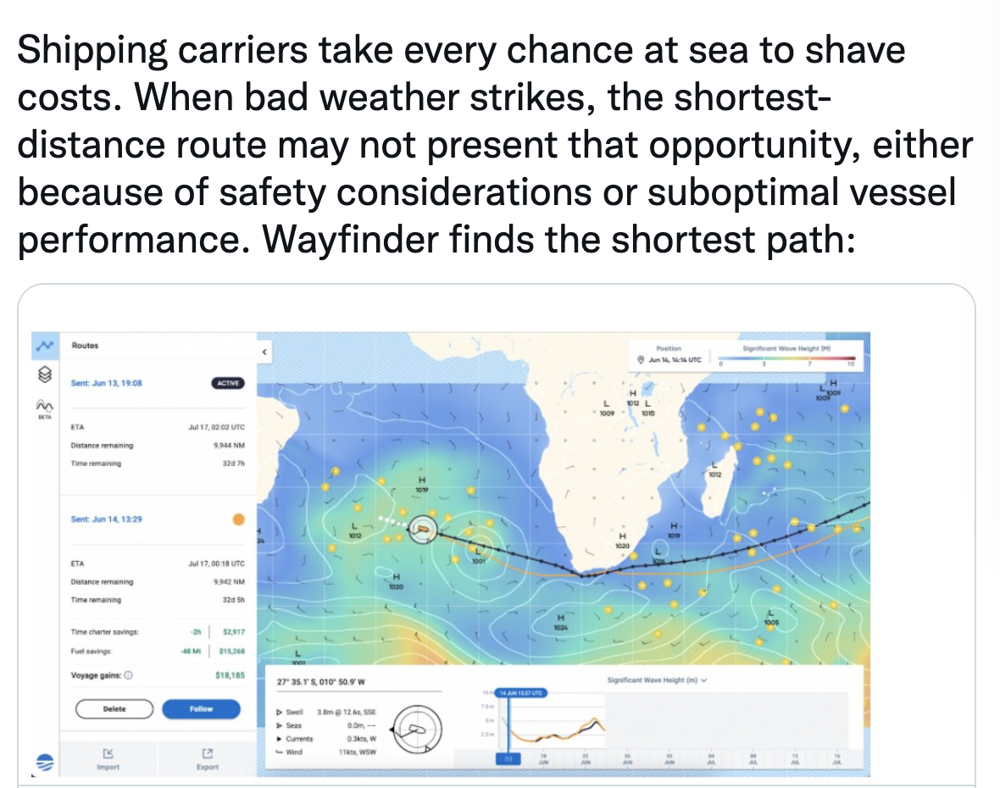
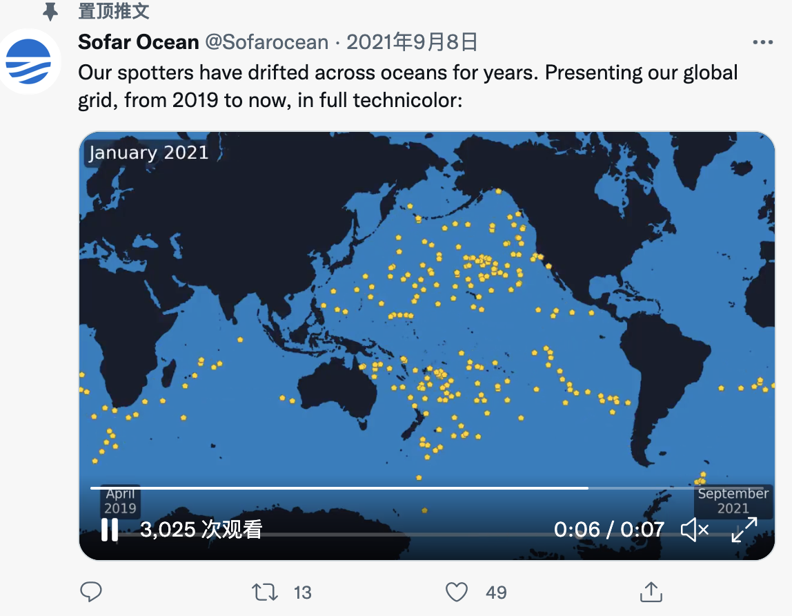
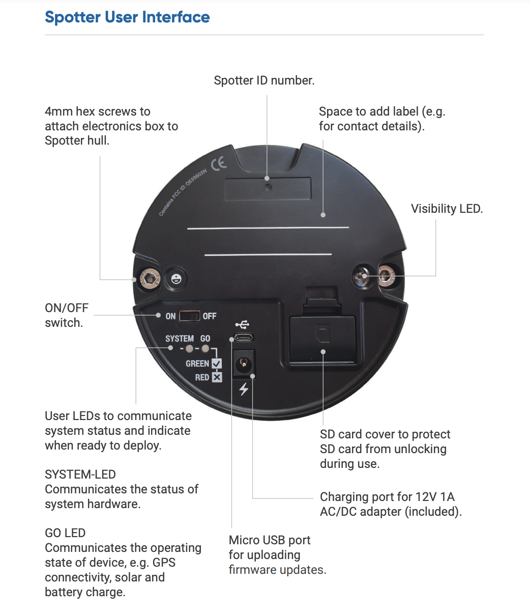
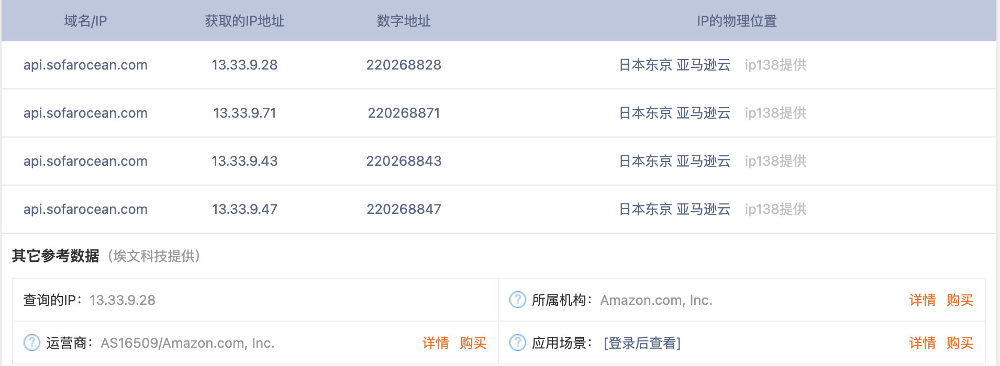
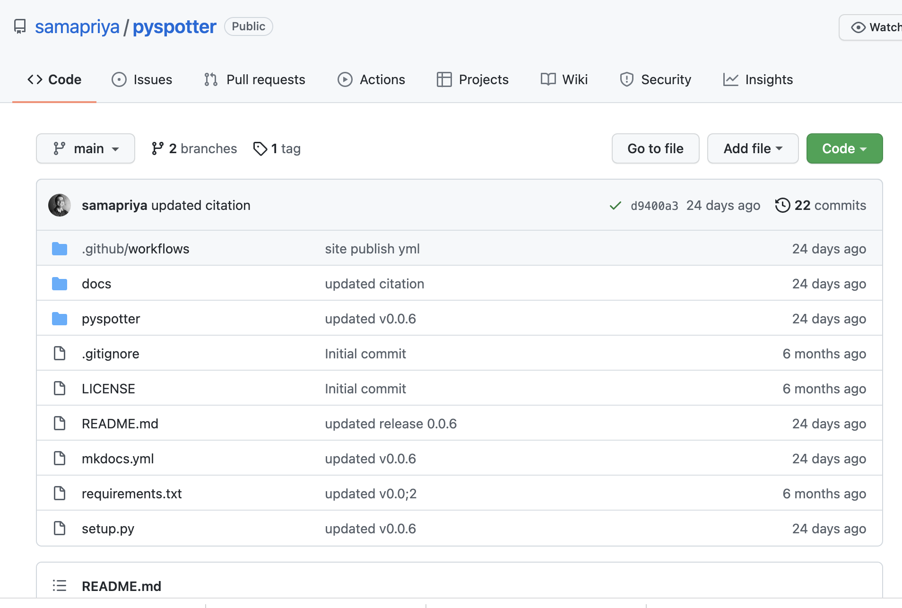

## 网站信息收集

### 官网信息收集

- spotter与卫星直接通信,并传输数据到数据中心

  

### 域名-ip

```
www.sofarocean.com   13.115.25.8    4225646932  日本东京 亚马逊云 ip138提供
www.sofarocean.com   13.112.212.160 225498272   日本东京 亚马逊云 ip138提供
www.sofarocean.com   54.250.33.70   922362182   日本东京 亚马逊云 ip138提供
```

1. whois查询

   

   

3. 子域名查询

   

   - 通过上面sptter官网的一系列的域名 ip查询,发现spotter的官网所在服务器都是亚马逊在日本的服务器,包括后面的api的服务器也是一样

### [twitter](https://twitter.com/Sofarocean)

- 收集海上的波浪信息,可以制定最快的行驶路线

  

- 遍布全球

  

### [帮助文档](https://www.sofarocean.com/posts/spotter-product-documentation)

1. 用户手册(https://content.sofarocean.com/hubfs/Spotter%20product%20documentation%20page/Spotter%20User%20Guide%2005_11_21.pdf)

   

   

2. spotter的api提供服务器(https://api.sofarocean.com/api)

   1. 服务器ip查询

      

   2. api请求

      ```shell
      curl "https://api.sofarocean.com/api/latest-data?spotterId=SPOT-0018" -H 'token: YOUR_API_TOKEN'
      
      curl "https://api.sofarocean.com/api/wave-data?spotterId=SPOT-0222&limit=20" -H 'token: YOUR_API_TOKEN'
      
      ```

### github信息收集

1. 提供api的服务器,也是亚马逊在日本的。github搜了一下没有找到泄漏的token,但是找到了一个spotter 解析api的项目(https://github.com/samapriya/pyspotter)

   

